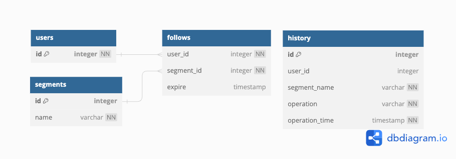
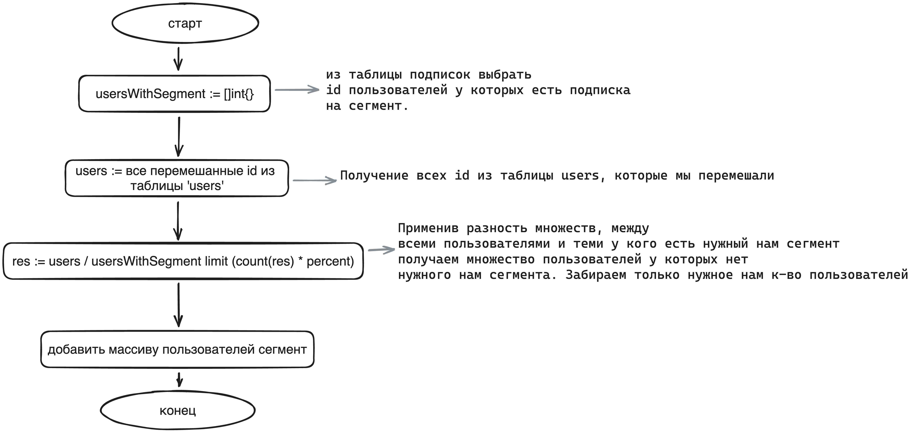

# Авито тестовое задание
## Запуск
~~~bash
git clone https://github.com/modaniru/avito-test
cd avito-test
~~~
Для того, чтобы локально запустить приложение нужно
создать в директории приложения .env файл.
### Переменные окружения
Структура .env файла представлена ниже или в файле .env.example
~~~bash
PORT=80 # Порт на котором будет запущено приложение
DB_USER=postgres # Имя пользователя бд
DB_PASSWORD=postgres # Пароль пользователя бд
DB_HOST=localhost:1111 # Хост базы данных, для запуска через docker-compose это поле игнорируется
DB_NAME=postgres # Имя базы данных
LOG_LEVEL=debug # Уровень логирования приложения (info, warn, error). debug установлен по умолчанию.
YANDEX_TOKEN=token # Yandex access token, его получение описано нижу
~~~
### Получение access token
Токен Яндекса можно получить тут: https://yandex.ru/dev/disk/poligon/

Если оставить поле YANDEX_TOKEN пустым, при запросе /history будет возвращаться статус 503 (Service Unavailable)
### Непосредственно запуск
После того, как были выполнены предыдущие шаги, можно приступать непосредственно к запуску
~~~bash
docker compose run
~~~
Приложение будет прослушиваться на 80 порту
## Описание эндпоинтов
### Postman
Описание эндпоинтов можно экспортировать в Postman, используя файл **avito.postman_collection.json**.
### Swagger
Swagger документацию можно получить по **localhost:80/swagger/**
### curl
#### Cохранение пользователя
Входные параметры:
- id - Идентификатор пользователя

Выходные параметры:
- Статус 201,  если пользователь сохранился
~~~bash
curl --location 'localhost:80/user' \
--header 'Content-Type: application/json' \
--data '{
    "id": 1
}'
~~~
---
#### Удаление пользователя
Описание: При удалении пользователя, удаляются доступы к сегментам.
Удаленные сегменты у пользователя заносятся в историю.

Входные параметры:
- id - Идентификатор пользователя

Выходные параметры:
- Статус 204, если пользователь был удален
~~~bash
curl --location --request DELETE 'localhost:80/user/' \
--header 'Content-Type: application/json' \
--data '{
    "id": 1
}'
~~~
---
#### Получение всех пользователей
Выходные параметры:
- Список идентификаторов
~~~bash
curl --location 'localhost:80/user/all' \
--data ''
~~~
---
#### Cохранение сегмента
Входные параметры:
- name - название сегмента

Выходные параметры:
- Идентификатор сегмента
- Статус 201, если сегмент был успешно сохранен
~~~bash
curl --location 'localhost:80/segment' \
--header 'Content-Type: application/json' \
--data '{
    "name": "AVITO_VOICE_MESSAGES"
}'
~~~
---
#### Удаление сегмента
Описание: При удалении сегмента, отписывает всех его пользователей.
Удаленный сегмент у пользователей заносится в историю.

Входные параметры:
- name - название сегмента

Выходные параметры:
- Статус 204, если сегмент был успешно удален
~~~bash
curl --location --request DELETE 'localhost:80/segment' \
--header 'Content-Type: application/json' \
--data '{
    "name": "AVITO_DISCOUNT_30"
}'
~~~
---
#### Получение сегментов
Выходные параметры:
- Список доступных сегментов
~~~bash
curl --location 'localhost:80/segment/all'
~~~
---
#### Добавление сегментов для пользователя
Входные параметры:
- user_id - идентификатор пользователя, если до этого пользователь не был создан, создает его
- []segments - список сегментов на добавление
- expire(optional) - добавляет время удаления сегмента у пользователя. Формат ГГГГ-ММ-ДД

Выходные параметры:
- Статус 201, если сегмент был успешно добавлен пользователю
~~~bash
curl --location 'localhost:80/user/segment/' \
--header 'Content-Type: application/json' \
--data '{
    "user_id": 1,
    "segments": ["AVITO_VOICE_MESSAGES","AVITO_DISCOUNT_50","AVITO_PERFORMANCE_VAS","AVITO_DISCOUNT_30"],
    "expire": "2023-08-28"
}'
~~~
---
#### Добавление сегмента определенному проценту пользователей без него
Входные параметры:
- name - название сегмента
- percent - процент пользователей, у которых еще нет этого сегмента

Выходные параметры:
- Статус 201, если сегмент был успешно добавлен пользователям
- rows_affected - количество затронутых пользователей
~~~bash
curl --location 'localhost:80/user/segment/auto' \
--header 'Content-Type: application/json' \
--data '{
    "name": "AVITO_IMAGES_213",
    "percent": 0.5
}'
~~~
---
#### Удаление сегментов у пользователя
Входные параметры:
- user_id - идентификатор пользователя
- []segments - список сегментов на удаление

Выходные параметры:
- Статус 204, если сегменты были успешно удалены у пользователя
~~~bash
curl --location --request DELETE 'localhost:80/user/segment/' \
--header 'Content-Type: application/json' \
--data '{
    "user_id": 1,
    "segments": ["AVITO_DISCOUNT_30"]
}'
~~~
---
#### Получение сегментов, доступных пользователю
Входные параметры:
- id - идентификатор пользователя

Выходные параметры:
- Список сегментов пользователя
~~~bash
curl --location --request GET 'localhost:80/user/segment/' \
--header 'Content-Type: application/json' \
--data '{
    "id": 1
}'
~~~
---
#### Получение истории добавления/удаления сегментов у пользователей
Входные параметры:
- date - История за определенный промежуток времени (Формат ГГГГ-ММ-ДД или ГГГГ-ММ)

Выходные параметры:
- Ссылка на скачивание csv файла
~~~bash
curl --location 'localhost:80/history/?date=2023-08-31'
~~~
---
## Архитектура и возникшие вопросы
### Архитектура базы данных

Было предпринято решение использовать отдельную таблицу с пользователями, в случае дальнейшего развития приложения (напр. фича, позволяющая *банить* пользователей на добавление им сегментов)
### Возникшие вопросы и проблемы
1. При удалении пользователя/сегмента, удаляются и их связи с таблицей follows.
Проблема состояла в том, что при таком удалении строк в таблице follows, они не записывались в таблицу с историей. (Сейчас записываются).
2. Выше расписана причина добавления отдельной таблицы для пользователей.
3. В качестве хранилища для csv файлов выступил Yandex disk в силу простой работы с ним.
4. над TTL был выбор между двумя вариантами его реализации.
    1. pgcron - Расширение для postgres, позволяющая создавать свои собственные запросы, которые будут выполняться с заданным интервалом.
    2. создание отдельно работующей горутины, которая через заданный промежуток времени будет обращаться к базе данных.
  
    Был выбран второй вариант в силу его простоты реализации. Также были сомнения использования cron'ов из-за того, что их нет в postgres по умолчанию.
5. Использование транзакций. При удалении или добавлении пользователя у нас записывается действие в таблицу с историями. Чтобы не было ситуации, когда выполнилось одно действие(напр. удаление сегмента) и не выполнилось другое(напр. запись в историю), были использованы транзакции.
Таким образом добавление/удаление сегментов у пользователя и запись в историю стали одной операцией, которая либо выполняется полностью, либо не выполняется вовсе.
6. Добавления случайному проценту X пользователей сегмент.
Проблема состояла в том, что нам нужно выбрать тех случайных пользователей, у которых нет предложенного нами сегмента, поэтому был использован следующий алгоритм выборки пользователей.

7. Использование моков. Чтобы протестировать сервисную логику и застраховаться от *заврашнего себя*, было принято написать ряд тестов.
Для того, чтобы \'мокнуть\' нужные нам зависимости (в моем случае уровень репозиториев), используется связность на уровне интерфейсов. С помощью инструмента mockery, который основывается на интерфейсы, были сгенерированы моки.
### Используемые зависимости
- [GoDotEnv](https://github.com/joho/godotenv) - для загрузки переменных окружения из .env файла
- [Clean Env](https://github.com/ilyakaznacheev/cleanenv) - для создания объекта структуры, в которой находятся значения переменных окружения 
- [chi](https://github.com/go-chi/chi) - Используемый роутер
- [testify](https://github.com/stretchr/testify) - для тестирования
- [mockery](https://github.com/vektra/mockery) - для генерации моков
- slog - была использована новая стандартная библиотка для логирования
- [swag](https://github.com/swaggo/swag) - для генерации swagger файлов
- [yandex-disk-sdk-go](https://github.com/nikitaksv/yandex-disk-sdk-go) - для обращения к Yandex disk API
